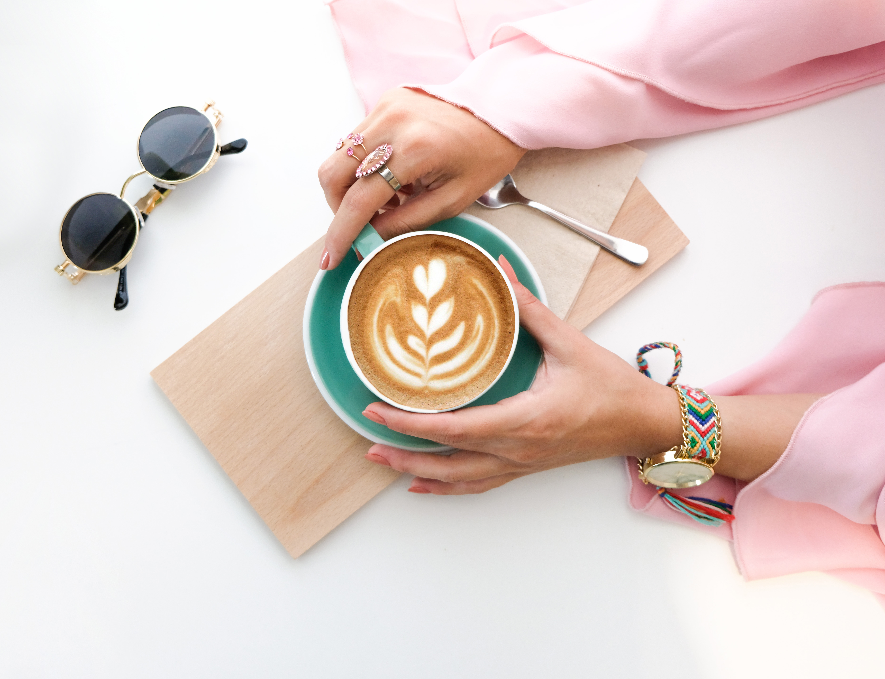
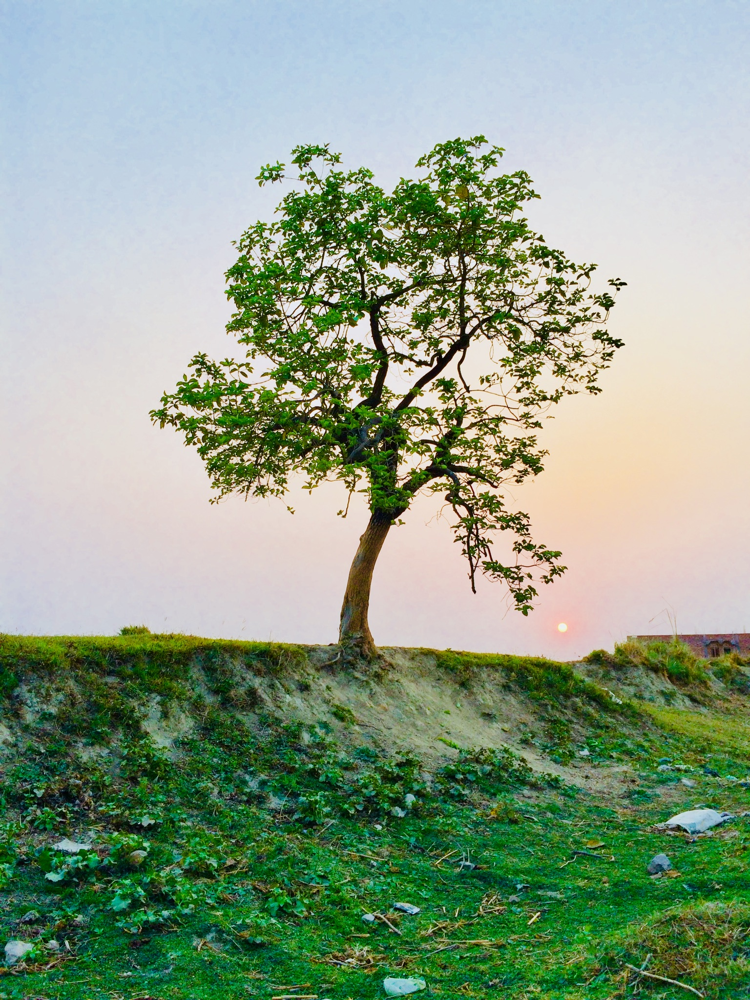
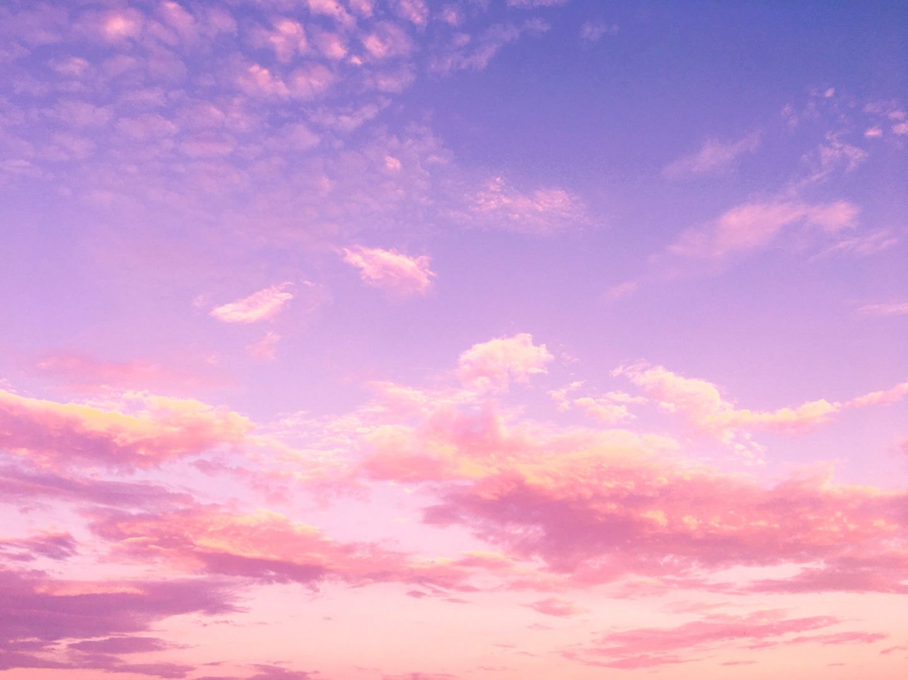
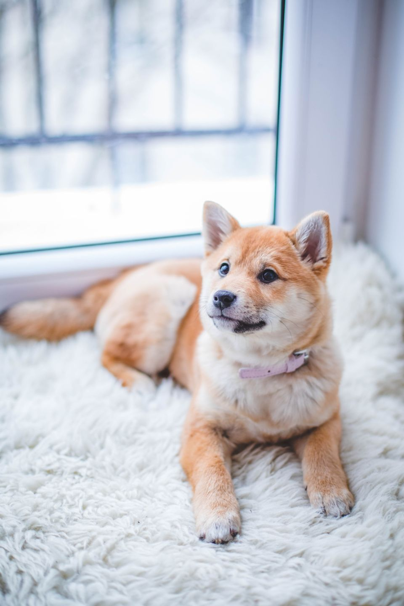
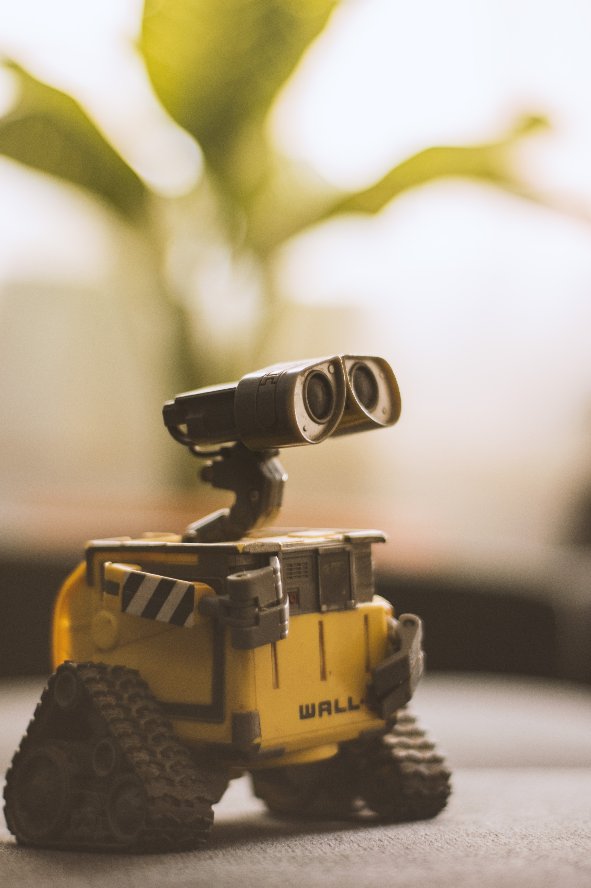
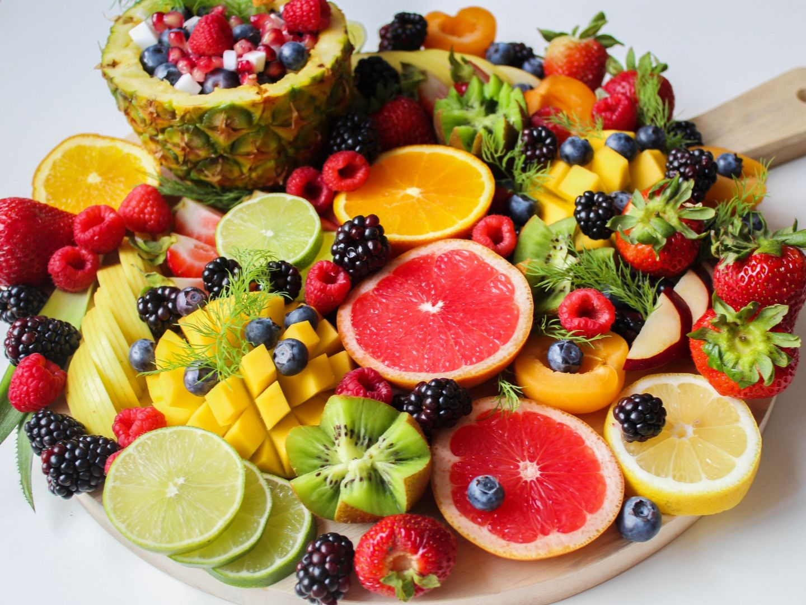

# Desafío 1 - 26/07/2020

Deberás implementar una galería de fotos, utilizando **solamente** HTML y CSS.

## Condiciones del desafío

⛔ No se puede utilizar JavaScript.

⛔ No se puede utilizar ningún framework de CSS.

✅ Debe soportar fotos horizontales y verticales.

✅ Debe poder ampliar una foto a su tamaño original o a un máximo determinado al hacerle un click.

✨ Serás libre de implementar la estética y funcionalidad que quieras, siempre y cuando se cumplan las condiciones esenciales del desafío.

## 📚 Herramientas de consulta

Podrás utilizar cualquier herramienta de búsqueda que necesites (amamos buscar en Google y leer Stack Overflow <3).

## ⏳ Tiempo

Tendrás **1 hora** para resolver el desafío.

## 🌈 Algunos ejemplos para que explores

- https://codepen.io/MalaikaIshtiaq/pen/MNbXyx
- https://codepen.io/thebabydino/pen/oWqpzw
- https://codepen.io/bbx/pen/Jxoqdg
- https://codepen.io/alchatti/pen/NOdzLO

## 📸 ¿De dónde saco fotos?

¡Este repositorio incluye algunas fotos de ejemplo! Están en la carpeta [`fotos`](./fotos): 



De todos modos, si tenés fotos que te gusten y quieras usarlas a mano, podés utilizar esas mismas. 

## 🤔 ¿Cómo presento mi código?

### Si tenés una cuenta en GitHub

Hacé un fork de este repo:


Cloná tu fork, reemplazando `[TU_ALIAS]` con el nombre de tu cuenta de GitHub. Podés clonarlo utilizando la consola:

```
git clone https://github.com/[TU_ALIAS]/DevOff-Desafio-1
```

También podés utilizar GitHub Desktop, tu IDE favorito, lo que gustes.

Cuando finalices la resolución del desafío, no olvides subir todos tus cambios usando `git push` o el equivalente que ofrezca tu cliente de Git. Envianos por el chat de la transmisión o por DM a la cuenta de Twitter de DevOff Argentina el link a tu repositorio.

### Si no tenés una cuenta en GitHub

[Podés hacer clic aquí y mágicamente se descargará un archivo comprimido con todo lo que contiene este repositorio](https://github.com/devoffarg/DevOff-Desafio-1/archive/master.zip).

Cuando finalices la resolución del desafío, envianos un archivo ZIP con todo tu trabajo a través de [WeTransfer](https://wetransfer.com/).

## 💜 Agradecimientos

### Jurados

- ¡Gracias a [Gonzalo Pozzo](https://twitter.com/goncy) y [Magalí Domínguez](https://twitter.com/printmaga) por ser nuestros jurados!
- ¡Un agradecimiento especial a [Damián Catanzaro](https://twitter.com/damiancatanzaro), el jurado invitado de esta edición!

### Organizaciones aliadas

¡Gracias a [Migue Moyano](https://twitter.com/elmiguedev), [Joel A. Villarreal Bertoldi](https://twitter.com/joelalejandro) y [Agustín Carrasco](https://twitter.com/asermax) del equipo de [CoDeAr](https://twitter.com/somoscodear) por dar una mano para que este proyecto sea posible! 

### Créditos

DevOff Argentina es un proyecto ideado por [Aldana Denise](https://twitter.com/gizmowis), con el apoyo de [CoDeAr](https://twitter.com/somoscodear).

Este desafío incluye fotos cortesía de las siguientes fuentes:

- [Close up photography of sleeping tabby cat](./fotos/01.jpg), de [Ihsan Adity](https://twitter.com/IhsanAdity)
- [Baking cheese cooking crust](./fotos/02.jpg), de [Pixabay](https://www.pexels.com/@pixabay)
- [Woman holding cup of latte](./fotos/03.jpg), de [The Lazy Artist](https://twitter.com/antassingh)
- [Photography of tree](./fotos/04.jpg), de [Yugal Srivastava](https://twitter.com/yugalsrivastava)
- [White clouds and blue sky](./fotos/05.jpg), de [Ithalu Dominguez](https://twitter.com/ithasud)
- [Brown and white short coated puppy](./fotos/06.jpg), de [Valeria Boltneva](https://instagram.com/tsapolka)
- [Food plate chocolate dessert](./fotos/07.jpg), de [Alexander Dummer](https://www.pexels.com/@alexander-dummer-37646)
- [Person holding multi-colored heart-shaped ornament](./fotos/08.jpg), de [Sharon McCutcheon](https://instagram.com/mccutcheonphoto)
- [Brown hummingbird selective focus photography](./fotos/09.jpg), de [Philippe Donn](https://twitter.com/philippedonnphotography)
- [Wall-e toy on beige pad](./fotos/10.jpg), de [Lenin Estrada](https://www.pexels.com/@lenin-estrada-117221)
- [Sliced fruits on tray](./fotos/11.jpg), de [Trang Doan](https://instagram.com/iamtrangdoan)
- [Person hand and crescent moon](./fotos/12.jpg), de [Kaique Rocha](https://instagram.com/hikaique)

# ¡Muchos éxitos y a codear!
